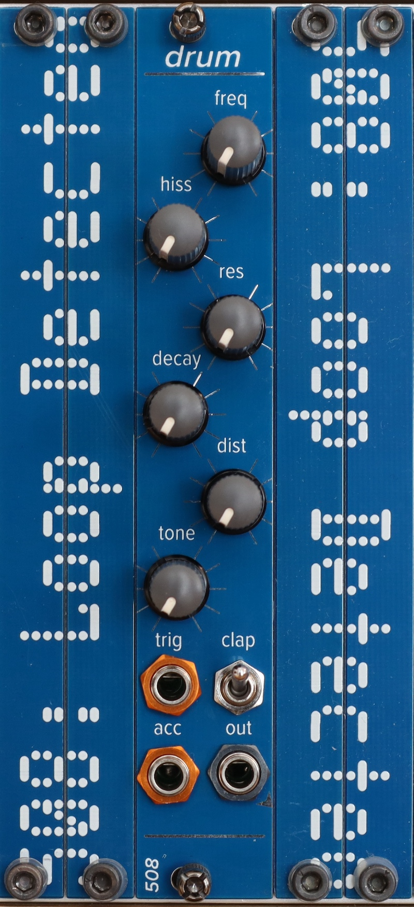

# drum

A 4HP Eurorack drum module comprised of two main elements: 

- a filtered noise source w/envelope, which is controlled by the three pots on the left
- a twin-T resonant filter for the drum shell sound, which is controlled by the three pots on the right

The switch labeled "clap" disables the shell sound, giving you just the noise half of the circuit.

There are two trigger inputs -- the "accent" input drives the circuit a little bit hotter than the main "trigger" input.

You can get a bunch of great kick sounds with the frequency down low, at various degrees of resonance, and with the distortion at various levels, with or without a little bit of noise. One of my faves is a little bit of noise with a lot of the high end removed by the filter, to the point that it sounds a little like room echo on the kick.

You can get a pretty solid snare with the frequency & noise maxed out. And the "clap" switch gives you just noise, which can be tweaked to provide some classic clap sounds.

I learned a ton, while designing this module, from Thomas Henry's Electronic Drum Cookbook, as always. And the core twin-T resonant circuit with transistor distortion is loosely based on the Leploop Cassa.

This module, like many of my modules, uses 2mm-pitch male/female headers. Be sure you order/use the right thing!

Most ICs are SOIC 8/14/16; all passives are 0805. The BOMs prefixed with `fixed` are easier to read; the others can be used along with the Pick-and-place and gerber files to order PCBs.

Here is a short video demo -- all drum sounds in this video are coming from the three drum modules: https://youtu.be/YkVDZHsPaZM
